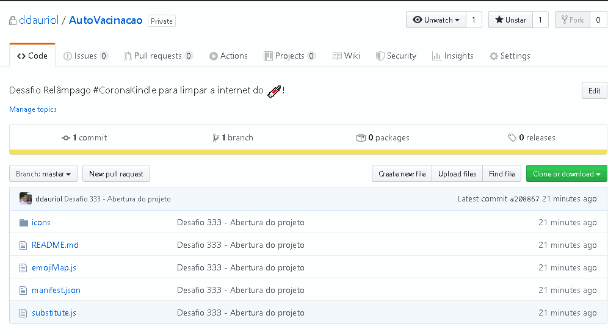

# Vacinação contra Corona Vírus

Esta extensão irá substituir as expressões relacionadas ao corona vírus (covid-19) por um emoticon de seringa.

## Desafio 333 - '#CoronaKindle'

Desafio Relâmpago #CoronaKindle para limpar a internet do 💉! Você tem uma semana para desenvolver uma extensão de Firefox ou Chrome. Envie o link da sua extensão com instruções de como testar neste tweet.

## Como usar:

Acesse o [GitHub do ddauriol](https://github.com/ddauriol/AutoVacinacao) e baixe a última versão da extensão e descompacte em um local conhecido.

Em seguida acesse a área de Debugging do Firefox digitando diretamente na barra de endereço: **"about: debugging"**, em seguida clique em **"Load Temporary Add-on"** e selecione o arquivo **_manifest.json_** entre os arquivos baixados.

Pronto, agora basta acessar os seus sites favoritos, que as expressões abaixo serão transformadas em uma 💉:

 - coronavirus
 - coronavírus
 - corona virus
 - corona vírus
 - covid-19
 - covid 19
 - covid

